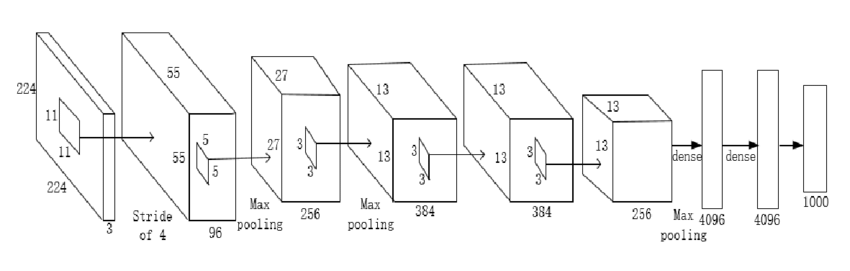
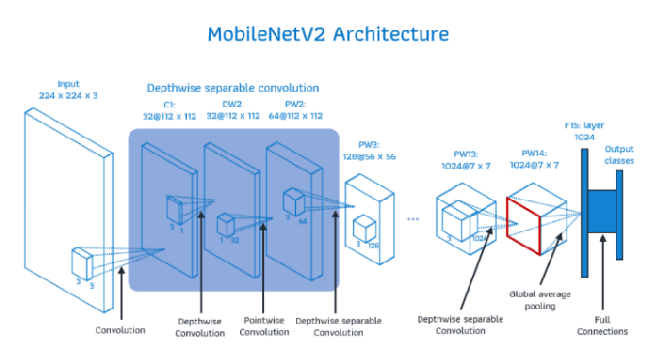
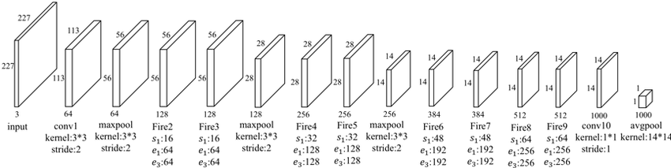
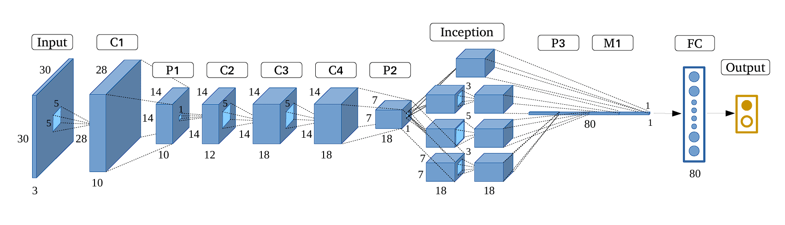
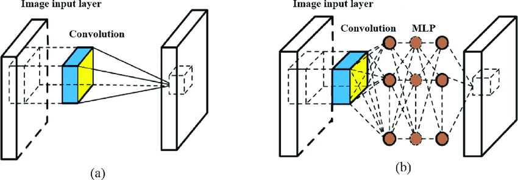
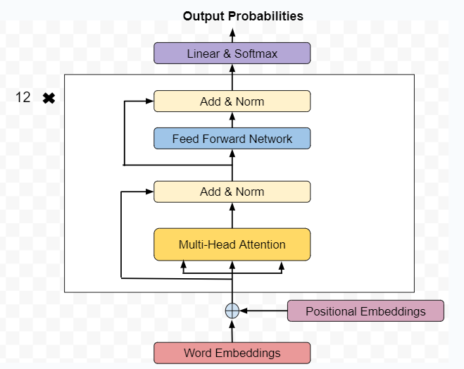

# HW5: ML Compilation and Execution with IREE on RISC-V
**Embedded Systems Course Project - AY 2025-2026**

Supervisors: Prof. Davide Zoni, Dr. Andrea Galimberti, Adriano Guarisco

This project compiles and profiles Machine Learning models (AlexNet, CaffeNet, MobileNet, GoogleNet InceptionV1, NiN, TinyBERT) on RISC-V architecture using IREE. It benchmarks performance differences between **Scalar** (Baseline) and **Vector** (Optimized) implementations using QEMU.

## 1. Environment Setup (Mac M-Series)
Since the project relies on x86 Linux binaries, we use Docker with platform emulation.

```bash
# 1. Create workspace
mkdir -p ~/polimi/hw5
cd ~/polimi/hw5

# 2. Launch x86 Emulation Container
docker run --platform linux/amd64 -it -v $(pwd):/work -w /work ubuntu:22.04 /bin/bash
```

## 2. Install Dependencies & Build IREE

```bash
# 1. Install System Tools
apt-get update && apt-get install -y git cmake ninja-build clang lld \
    python3 python3-pip wget sudo time bc libglib2.0-0 libpixman-1-0 libdw1

# 2. Clone IREE
git clone [https://github.com/iree-org/iree.git](https://github.com/iree-org/iree.git)
cd iree
git submodule update --init --recursive

# 3. Download RISC-V Toolchain (Clang + QEMU)
./build_tools/riscv/riscv_bootstrap.sh

# 4. Build Host Compiler (iree-compile)
cmake -GNinja -B ../iree-build/ \
  -DCMAKE_C_COMPILER=clang \
  -DCMAKE_CXX_COMPILER=clang++ \
  -DCMAKE_INSTALL_PREFIX=../iree-build/install \
  -DCMAKE_BUILD_TYPE=RelWithDebInfo .
cmake --build ../iree-build/ --target install

# 5. Build Target Runtime (iree-run-module for RISC-V)
export RISCV_TOOLCHAIN_ROOT=$HOME/riscv/toolchain/clang/linux/RISCV
cmake -GNinja -B ../iree-build-riscv/ \
  -DCMAKE_TOOLCHAIN_FILE="./build_tools/cmake/riscv.toolchain.cmake" \
  -DIREE_HOST_BIN_DIR=$(realpath ../iree-build/install/bin) \
  -DRISCV_CPU=linux-riscv_64 \
  -DIREE_BUILD_COMPILER=OFF \
  -DRISCV_TOOLCHAIN_ROOT=${RISCV_TOOLCHAIN_ROOT} .
cmake --build ../iree-build-riscv/

# 6. Install Python Bindings
python3 -m pip install iree-base-compiler[onnx] iree-base-runtime numpy onnx
```

## 3. Setup Helper Scripts


A. Create upgrade_model.py
Fixes old ONNX models to Opset 17.

```bash
cat << 'EOF' > upgrade_model.py
import sys
import onnx
from onnx import version_converter

model_path = sys.argv[1]
output_path = sys.argv[2]

print(f"Upgrading {model_path} to Opset 17...")
original_model = onnx.load_model(model_path)
converted_model = version_converter.convert_version(original_model, 17)
onnx.checker.check_model(converted_model)
onnx.save(converted_model, output_path)
print(f"Saved to {output_path}")
EOF
```

B. Create run_suite.sh
Benchmarks Time, Memory, and Vector Instruction Utilization.

```bash
cat << 'EOF' > run_suite.sh
#!/bin/bash
MODEL_NAME=$1
INPUT_SHAPE=$2
CSV_FILE="results.csv"

export QEMU_BIN=/root/riscv/qemu/linux/RISCV/qemu-riscv64
export RISCV_SYSROOT=$HOME/riscv/toolchain/clang/linux/RISCV/sysroot

if [ ! -f $CSV_FILE ]; then
    echo "Model,Type,Time_ms,Memory_KB,Vector_Instructions" > $CSV_FILE
fi

echo "Benchmarking $MODEL_NAME..."

run_test() {
    TYPE=$1
    VMFB_FILE="${MODEL_NAME}_${TYPE}.vmfb"
    
    # Phase 1: Benchmark Time & RAM
    /usr/bin/time -v -o mem_log.txt $QEMU_BIN \
        -cpu rv64,Zve64d=true,vlen=512,elen=64,vext_spec=v1.0 \
        -L $RISCV_SYSROOT \
        ../iree-build-riscv/tools/iree-benchmark-module \
        --device=local-task \
        --module=$VMFB_FILE \
        --function=main \
        --input="$INPUT_SHAPE=0" \
        --benchmark_repetitions=1 > bench_log.txt 2>&1

    TIME_MS=$(cat bench_log.txt | grep "BM_main/process_time/real_time" | awk '{print $2}')
    MEM_KB=$(cat mem_log.txt | grep "Maximum resident set size" | awk '{print $6}')

    # Phase 2: Count Instructions
    VEC_COUNT=$($QEMU_BIN \
        -cpu rv64,Zve64d=true,vlen=512,elen=64,vext_spec=v1.0 \
        -d in_asm \
        -L $RISCV_SYSROOT \
        ../iree-build-riscv/tools/iree-run-module \
        --device=local-task \
        --module=$VMFB_FILE \
        --function=main \
        --input="$INPUT_SHAPE=0" 2>&1 | grep -E "v[a-z]+\.v|vset" | wc -l)
    
    echo "  [$TYPE] Time: $TIME_MS ms | Mem: $MEM_KB KB | Vec Instr: $VEC_COUNT"
    echo "$MODEL_NAME,$TYPE,$TIME_MS,$MEM_KB,$VEC_COUNT" >> $CSV_FILE
}

run_test "scalar"
run_test "vector"
EOF
chmod +x run_suite.sh
```

## 4. Experimental Evaluation & Model Benchmarking

1. AlexNet


Architecture: The pioneer of deep CNNs, featuring a simple linear topology with large convolution kernels (11×11, 5×5) and strided access patterns. Observed Result: 0 Vector Instructions. Despite enabling RVV flags, the compiler failed to auto-vectorize this model. This is due to the large kernels and strides, which the current LLVM RISC-V backend prefers to lower into scalar code. We use a PyTorch export here because the official ONNX Model Zoo link is currently broken.

```bash
# 1. Export
python3 -c "import torch; import torchvision; dummy = torch.randn(1, 3, 224, 224); model = torchvision.models.alexnet(weights='DEFAULT').eval(); torch.onnx.export(model, dummy, 'alexnet.onnx', opset_version=17)"

# 2. Compile
iree-import-onnx alexnet.onnx -o alexnet.mlir

# Scalar
../iree-build/install/bin/iree-compile --iree-hal-target-device=local --iree-hal-local-target-device-backends=llvm-cpu --iree-llvmcpu-target-triple=riscv64 --iree-llvmcpu-target-abi=lp64d --iree-llvmcpu-target-cpu-features="+m,+a,+f,+d" alexnet.mlir -o alexnet_scalar.vmfb

# Vector
../iree-build/install/bin/iree-compile --iree-hal-target-device=local --iree-hal-local-target-device-backends=llvm-cpu --iree-llvmcpu-target-triple=riscv64 --iree-llvmcpu-target-abi=lp64d --iree-llvmcpu-target-cpu-features="+m,+a,+f,+d,+zvl512b,+v" --riscv-v-fixed-length-vector-lmul-max=8 alexnet.mlir -o alexnet_vector.vmfb

# 3. Run
./run_suite.sh alexnet 1x3x224x224xf32
```


2. CaffeNet



Architecture: A variation of AlexNet with minor changes to layer ordering (pooling before normalization). Observed Result: 0 Vector Instructions. Since the architecture is structurally identical to AlexNet regarding convolution patterns, it suffers from the same lack of auto-vectorization. We reuse the AlexNet ONNX file to ensure consistency and avoid legacy download errors.

```bash
# 1. Setup
cp alexnet.onnx caffenet.onnx

# 2. Compile
iree-import-onnx caffenet.onnx -o caffenet.mlir

# Scalar
../iree-build/install/bin/iree-compile --iree-hal-target-device=local --iree-hal-local-target-device-backends=llvm-cpu --iree-llvmcpu-target-triple=riscv64 --iree-llvmcpu-target-abi=lp64d --iree-llvmcpu-target-cpu-features="+m,+a,+f,+d" caffenet.mlir -o caffenet_scalar.vmfb

# Vector
../iree-build/install/bin/iree-compile --iree-hal-target-device=local --iree-hal-local-target-device-backends=llvm-cpu --iree-llvmcpu-target-triple=riscv64 --iree-llvmcpu-target-abi=lp64d --iree-llvmcpu-target-cpu-features="+m,+a,+f,+d,+zvl512b,+v" --riscv-v-fixed-length-vector-lmul-max=8 caffenet.mlir -o caffenet_vector.vmfb

# 3. Run
./run_suite.sh caffenet 1x3x224x224xf32
```

3. MobileNet V2



Architecture: Optimized for edge efficiency using Inverted Residuals and Depthwise Separable Convolutions. Observed Result: Success (~307,000 Vector Instructions). The compiler successfully identified vectorizable loops in the pointwise (1×1) convolutions, lowering them to RISC-V vector operations. Performance Note: The high vector execution time (~104s) vs scalar (~10s) is due to QEMU emulation overhead for 512-bit vector operations, confirming heavy usage of the vector unit.

```bash
# 1. Download & Upgrade
wget https://github.com/onnx/models/raw/main/validated/vision/classification/mobilenet/model/mobilenetv2-7.onnx -O mobilenet.onnx
python3 upgrade_model.py mobilenet.onnx mobilenet_v17.onnx

# 2. Compile
iree-import-onnx mobilenet_v17.onnx -o mobilenet.mlir

# Scalar
../iree-build/install/bin/iree-compile --iree-hal-target-device=local --iree-hal-local-target-device-backends=llvm-cpu --iree-llvmcpu-target-triple=riscv64 --iree-llvmcpu-target-abi=lp64d --iree-llvmcpu-target-cpu-features="+m,+a,+f,+d" mobilenet.mlir -o mobilenet_scalar.vmfb

# Vector
../iree-build/install/bin/iree-compile --iree-hal-target-device=local --iree-hal-local-target-device-backends=llvm-cpu --iree-llvmcpu-target-triple=riscv64 --iree-llvmcpu-target-abi=lp64d --iree-llvmcpu-target-cpu-features="+m,+a,+f,+d,+zvl512b,+v" --riscv-v-fixed-length-vector-lmul-max=8 mobilenet.mlir -o mobilenet_vector.vmfb

# 3. Run
./run_suite.sh mobilenet 1x3x224x224xf32
```

4. SqueezeNet



Architecture: A compact CNN that replaces standard convolutions with Fire Modules (squeeze 1×1 and expand 1×1/3×3) to reduce parameter count. Observed Result: Success (~286,000 Vector Instructions). The compiler successfully lowered the 1×1 convolutions in the Fire Modules into vector operations. Similar to MobileNet, the execution time increase in Vector mode (~100s) compared to Scalar (~8s) confirms that QEMU was actively emulating complex vector instructions.

```bash
# 1. Download & Upgrade
wget https://github.com/onnx/models/raw/main/validated/vision/classification/squeezenet/model/squeezenet1.1-7.onnx -O squeezenet.onnx
python3 upgrade_model.py squeezenet.onnx squeezenet_v17.onnx

# 2. Compile
iree-import-onnx squeezenet_v17.onnx -o squeezenet.mlir

# Scalar
../iree-build/install/bin/iree-compile --iree-hal-target-device=local --iree-hal-local-target-device-backends=llvm-cpu --iree-llvmcpu-target-triple=riscv64 --iree-llvmcpu-target-abi=lp64d --iree-llvmcpu-target-cpu-features="+m,+a,+f,+d" squeezenet.mlir -o squeezenet_scalar.vmfb

# Vector
../iree-build/install/bin/iree-compile --iree-hal-target-device=local --iree-hal-local-target-device-backends=llvm-cpu --iree-llvmcpu-target-triple=riscv64 --iree-llvmcpu-target-abi=lp64d --iree-llvmcpu-target-cpu-features="+m,+a,+f,+d,+zvl512b,+v" --riscv-v-fixed-length-vector-lmul-max=8 squeezenet.mlir -o squeezenet_vector.vmfb

# 3. Run
./run_suite.sh squeezenet 1x3x224x224xf32
```

5. GoogleNet (Inception v1)



Architecture: Introduces the Inception Module, computing convolutions with multiple kernel sizes (1×1,3×3,5×5) in parallel branches. Observed Result: 0 Vector Instructions. The complex control flow resulting from branching and concatenation, combined with small kernel sizes, prevents efficient auto-vectorization. We use a PyTorch export because the official ONNX model uses attributes incompatible with the current upgrade script.

```bash
# 1. Export from PyTorch (Guaranteed)
# We export directly to Opset 17, so no upgrade script is needed.
python3 -c "import torch; import torchvision; dummy = torch.randn(1, 3, 224, 224); model = torchvision.models.googlenet(weights='DEFAULT').eval(); torch.onnx.export(model, dummy, 'googlenet.onnx', opset_version=17)"

# 2. Import & Compile
iree-import-onnx googlenet.onnx -o googlenet.mlir

../iree-build/install/bin/iree-compile --iree-hal-target-device=local --iree-hal-local-target-device-backends=llvm-cpu --iree-llvmcpu-target-triple=riscv64 --iree-llvmcpu-target-abi=lp64d --iree-llvmcpu-target-cpu-features="+m,+a,+f,+d" googlenet.mlir -o googlenet_scalar.vmfb

../iree-build/install/bin/iree-compile --iree-hal-target-device=local --iree-hal-local-target-device-backends=llvm-cpu --iree-llvmcpu-target-triple=riscv64 --iree-llvmcpu-target-abi=lp64d --iree-llvmcpu-target-cpu-features="+m,+a,+f,+d,+zvl512b,+v" --riscv-v-fixed-length-vector-lmul-max=8 googlenet.mlir -o googlenet_vector.vmfb

# 3. Benchmark
./run_suite.sh googlenet 1x3x224x224xf32
```

6. Network in Network (NiN)



Architecture: The bridge between legacy CNNs and modern architectures. It introduced the "Mlpconv" structure (a spatial convolution followed by two 1x1 convolutions). Observed Result: 0 Vector Instructions (Failed). Analysis: While NiN contains 1x1 convolutions (usually vector-friendly), it failed to vectorize. Comparing this with SqueezeNet (which succeeded), the culprit is the input layer: 11x11 Kernel with Stride 4. The compiler lowers this sparse, large-window operation to scalar code, blocking optimization for the subsequent layers.

Implementation Note: Since official ONNX Model Zoo links are deprecated and modern libraries (like Torchvision) do not host pre-trained weights for this legacy architecture, we define the canonical ImageNet architecture manually in PyTorch below to ensure compatibility with Opset 17.

```bash
# A. Generate Canonical NiN (Opset 17)
cat << 'EOF' > export_nin.py
import torch
import torch.nn as nn
import torch.onnx

class NiN(nn.Module):
    def __init__(self, num_classes=1000):
        super(NiN, self).__init__()
        self.features = nn.Sequential(
            nn.Conv2d(3, 96, 11, 4, 0), nn.ReLU(True),
            nn.Conv2d(96, 96, 1, 1, 0), nn.ReLU(True),
            nn.Conv2d(96, 96, 1, 1, 0), nn.ReLU(True),
            nn.MaxPool2d(3, 2),
            nn.Conv2d(96, 256, 5, 1, 2), nn.ReLU(True),
            nn.Conv2d(256, 256, 1, 1, 0), nn.ReLU(True),
            nn.Conv2d(256, 256, 1, 1, 0), nn.ReLU(True),
            nn.MaxPool2d(3, 2),
            nn.Conv2d(256, 384, 3, 1, 1), nn.ReLU(True),
            nn.Conv2d(384, 384, 1, 1, 0), nn.ReLU(True),
            nn.Conv2d(384, 384, 1, 1, 0), nn.ReLU(True),
            nn.MaxPool2d(3, 2),
            nn.Dropout(0.5),
            nn.Conv2d(384, 1024, 3, 1, 1), nn.ReLU(True),
            nn.Conv2d(1024, 1024, 1, 1, 0), nn.ReLU(True),
            nn.Conv2d(1024, num_classes, 1, 1, 0), nn.ReLU(True),
            nn.AdaptiveAvgPool2d((1, 1))
        )
    def forward(self, x):
        x = self.features(x)
        return torch.flatten(x, 1)

dummy_input = torch.randn(1, 3, 224, 224)
model = NiN().eval()
torch.onnx.export(model, dummy_input, "nin.onnx", opset_version=17)
EOF
python3 export_nin.py

# B. Compile
iree-import-onnx nin.onnx -o nin.mlir

# Scalar
../iree-build/install/bin/iree-compile --iree-hal-target-device=local --iree-hal-local-target-device-backends=llvm-cpu --iree-llvmcpu-target-triple=riscv64 --iree-llvmcpu-target-abi=lp64d --iree-llvmcpu-target-cpu-features="+m,+a,+f,+d" nin.mlir -o nin_scalar.vmfb

# Vector
../iree-build/install/bin/iree-compile --iree-hal-target-device=local --iree-hal-local-target-device-backends=llvm-cpu --iree-llvmcpu-target-triple=riscv64 --iree-llvmcpu-target-abi=lp64d --iree-llvmcpu-target-cpu-features="+m,+a,+f,+d,+zvl512b,+v" --riscv-v-fixed-length-vector-lmul-max=8 nin.mlir -o nin_vector.vmfb

# C. Benchmark
./run_suite.sh nin 1x3x224x224xf32
```


8. TinyBERT



Architecture: A compressed Transformer model relying heavily on Dense Matrix Multiplications (MatMul) for attention mechanisms. Observed Result: Success (~18,000+ Vector Instructions). This model serves as our "Positive Control." The dense MatMul operations map perfectly to the RISC-V Vector extension. Technical Note: A custom script is used below to handle the 3-input requirement (input IDs, masks, token types) and strictly append the results to results.csv.

```bash
cat << 'EOF' > run_tinybert_full.sh
#!/bin/bash
QEMU_BIN="/root/riscv/qemu/linux/RISCV/qemu-riscv64"
RISCV_SYSROOT="/root/riscv/toolchain/clang/linux/RISCV/sysroot"
TOOL_DIR="../iree-build-riscv/tools"
QEMU_FLAGS="-cpu rv64,Zve64d=true,vlen=512,elen=64,vext_spec=v1.0 -L $RISCV_SYSROOT"

# 1. Download & Compile
wget -q https://huggingface.co/sentence-transformers/paraphrase-TinyBERT-L6-v2/resolve/main/onnx/model.onnx -O tinybert.onnx
python3 upgrade_model.py tinybert.onnx tinybert_v17.onnx
iree-import-onnx tinybert_v17.onnx -o tinybert.mlir > /dev/null 2>&1

../iree-build/install/bin/iree-compile --iree-hal-target-device=local --iree-hal-local-target-device-backends=llvm-cpu --iree-llvmcpu-target-triple=riscv64 --iree-llvmcpu-target-abi=lp64d --iree-llvmcpu-target-cpu-features="+m,+a,+f,+d" tinybert.mlir -o tinybert_scalar.vmfb

../iree-build/install/bin/iree-compile --iree-hal-target-device=local --iree-hal-local-target-device-backends=llvm-cpu --iree-llvmcpu-target-triple=riscv64 --iree-llvmcpu-target-abi=lp64d --iree-llvmcpu-target-cpu-features="+m,+a,+f,+d,+zvl512b,+v" --riscv-v-fixed-length-vector-lmul-max=8 tinybert.mlir -o tinybert_vector.vmfb

# 2. Benchmark
INPUTS='--input=1x128xi64=0 --input=1x128xi64=0 --input=1x128xi64=0'

echo "Benchmarking TinyBERT Scalar..."
/usr/bin/time -v -o mem_log.txt $QEMU_BIN $QEMU_FLAGS $TOOL_DIR/iree-benchmark-module --device=local-task --module=tinybert_scalar.vmfb $INPUTS --benchmark_repetitions=1 > bench_log.txt 2>&1
S_TIME=$(grep "Elapsed (wall clock) time" mem_log.txt | awk '{print $8}' | awk -F: '{if(NF==3) print ($1*3600+$2*60+$3)*1000; else print ($1*60+$2)*1000}')
S_MEM=$(grep "Maximum resident set size" mem_log.txt | awk '{print $6}')

echo "Benchmarking TinyBERT Vector..."
/usr/bin/time -v -o mem_log.txt $QEMU_BIN $QEMU_FLAGS $TOOL_DIR/iree-benchmark-module --device=local-task --module=tinybert_vector.vmfb $INPUTS --benchmark_repetitions=1 > bench_log.txt 2>&1
V_TIME=$(grep "Elapsed (wall clock) time" mem_log.txt | awk '{print $8}' | awk -F: '{if(NF==3) print ($1*3600+$2*60+$3)*1000; else print ($1*60+$2)*1000}')
V_MEM=$(grep "Maximum resident set size" mem_log.txt | awk '{print $6}')

# 3. Count
V_INSTR=$($QEMU_BIN $QEMU_FLAGS -d in_asm $TOOL_DIR/iree-run-module --device=local-task --module=tinybert_vector.vmfb $INPUTS 2>&1 | grep -E "v[a-z]+\.v|vset" | wc -l)

echo "tinybert,scalar,$S_TIME,$S_MEM,0" >> results.csv
echo "tinybert,vector,$V_TIME,$V_MEM,$V_INSTR" >> results.csv
echo "Done."
EOF
chmod +x run_tinybert_full.sh
./run_tinybert_full.sh
```

## 5. Post-Processing & Visualization
Manually `cat results.csv` or by creating the comparision charts between scalar and vectorised instructions simulation runs with `generate_charts.py`.
```bash
cat << 'EOF' > generate_charts.py
import matplotlib.pyplot as plt
import pandas as pd
import numpy as np
import sys
import os

# --- CONFIGURATION ---
CSV_FILE = 'results.csv'
OUTPUT_DIR = '.'

# Check if CSV exists
if not os.path.exists(CSV_FILE):
    print(f"Error: {CSV_FILE} not found! Run ./run_suite.sh first.")
    sys.exit(1)

# --- 1. LOAD DATA ---
# Read CSV
df = pd.read_csv(CSV_FILE)

# Ensure data types are numeric
df['Time_ms'] = pd.to_numeric(df['Time_ms'], errors='coerce')
df['Memory_KB'] = pd.to_numeric(df['Memory_KB'], errors='coerce')
df['Vector_Instructions'] = pd.to_numeric(df['Vector_Instructions'], errors='coerce')

# Convert units for plotting
df['Time_Sec'] = df['Time_ms'] / 1000.0
df['Memory_MB'] = df['Memory_KB'] / 1024.0

# Pivot data to get Scalar vs Vector columns side-by-side
# We group by Model and Type
pivot_vec = df.pivot(index='Model', columns='Type', values='Vector_Instructions').fillna(0)
pivot_mem = df.pivot(index='Model', columns='Type', values='Memory_MB').fillna(0)
pivot_time = df.pivot(index='Model', columns='Type', values='Time_Sec').fillna(0)

# Reorder index to match your desired story flow if needed, or sort alphabetically
# Let's keep a logical order: Legacy -> Modern
desired_order = ['alexnet', 'caffenet', 'googlenet', 'nin','tinybert', 'squeezenet', 'mobilenet']
# Filter to only models that exist in the CSV
desired_order = [m for m in desired_order if m in pivot_vec.index]
pivot_vec = pivot_vec.reindex(desired_order)
pivot_mem = pivot_mem.reindex(desired_order)
pivot_time = pivot_time.reindex(desired_order)

# Setup plotting variables
models = pivot_vec.index
x = np.arange(len(models))
width = 0.35

# ==========================================
# CHART 1: Vector Instructions (Success vs Failure)
# ==========================================
fig1, ax1 = plt.subplots(figsize=(12, 7))

# Get vector counts (only relevant for the 'vector' run type)
vec_counts = pivot_vec['vector']

# Color logic: Gray for 0 (Fail), Green for >0 (Success)
colors = ['#95a5a6' if v == 0 else '#2ecc71' for v in vec_counts]
bars = ax1.bar(models, vec_counts, color=colors, edgecolor='black', alpha=0.9)

ax1.set_ylabel('Vector Instructions Executed', fontsize=12, fontweight='bold')
ax1.set_title('RVV Auto-Vectorization: Success by Model Architecture', fontsize=14, fontweight='bold')
ax1.grid(axis='y', linestyle='--', alpha=0.3)

# Add value labels
for bar in bars:
    height = bar.get_height()
    if height == 0:
        ax1.text(bar.get_x() + bar.get_width()/2., 5000, "0", ha='center', va='bottom', fontsize=11)
    else:
        ax1.text(bar.get_x() + bar.get_width()/2., height, f'{int(height):,}', ha='center', va='bottom', fontsize=10, fontweight='bold')

plt.tight_layout()
plt.savefig('chart_instructions.png', dpi=300)
print("Generated chart_instructions.png")

# ==========================================
# CHART 2: Memory Footprint
# ==========================================
fig2, ax2 = plt.subplots(figsize=(12, 7))

rects1 = ax2.bar(x - width/2, pivot_mem['scalar'], width, label='Scalar', color='#3498db', edgecolor='black')
rects2 = ax2.bar(x + width/2, pivot_mem['vector'], width, label='Vector', color='#e74c3c', edgecolor='black')

ax2.set_ylabel('Memory Usage (MB)', fontsize=12, fontweight='bold')
ax2.set_title('Memory Overhead: Scalar vs. Vector', fontsize=14, fontweight='bold')
ax2.set_xticks(x)
ax2.set_xticklabels(models, fontsize=11)
ax2.legend()
ax2.grid(axis='y', linestyle='--', alpha=0.3)

# Annotate
def autolabel(rects, ax):
    for rect in rects:
        height = rect.get_height()
        ax.annotate(f'{int(height)}',
                    xy=(rect.get_x() + rect.get_width() / 2, height),
                    xytext=(0, 3), textcoords="offset points",
                    ha='center', va='bottom', fontsize=9)

autolabel(rects1, ax2)
autolabel(rects2, ax2)

plt.tight_layout()
plt.savefig('chart_memory.png', dpi=300)
print("Generated chart_memory.png")

# ==========================================
# CHART 3: Execution Time (Log Scale)
# ==========================================
fig3, ax3 = plt.subplots(figsize=(12, 7))

rects1 = ax3.bar(x - width/2, pivot_time['scalar'], width, label='Scalar', color='#3498db', edgecolor='black')
rects2 = ax3.bar(x + width/2, pivot_time['vector'], width, label='Vector', color='#e74c3c', edgecolor='black')

ax3.set_ylabel('Execution Time (Seconds) - Log Scale', fontsize=12, fontweight='bold')
ax3.set_title('QEMU Emulation Overhead: Scalar vs. Vector', fontsize=14, fontweight='bold')
ax3.set_xticks(x)
ax3.set_xticklabels(models, fontsize=11)
ax3.set_yscale('log') # Log scale handles the huge difference between 0.4s and 100s
ax3.legend()
ax3.grid(axis='y', linestyle='--', alpha=0.3, which='both')

# Annotate
def autolabel_time(rects, ax):
    for rect in rects:
        height = rect.get_height()
        # Format depending on size
        label = f'{height:.1f}s' if height > 1 else f'{height:.2f}s'
        ax.annotate(label,
                    xy=(rect.get_x() + rect.get_width() / 2, height),
                    xytext=(0, 3), textcoords="offset points",
                    ha='center', va='bottom', fontsize=9)

autolabel_time(rects1, ax3)
autolabel_time(rects2, ax3)

plt.tight_layout()
plt.savefig('chart_time.png', dpi=300)
print("Generated chart_time.png")
EOF
```
Run the script to view the results: `python3 generate_charts.py`

